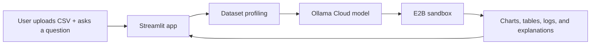

# AI Data Visualization Agent

AI Data Visualization Agent is a Streamlit application for exploring CSV datasets with natural-language prompts. It combines dataset profiling, chart generation, Python execution, and result review in one interface.

## Overview

The app is designed for a simple workflow:

1. Start on the `Information` page to review the product overview.
2. Move to `AI Workspace` to upload a CSV file and run analysis prompts.
3. Review the uploaded dataset in `Dataset Lab`.
4. Inspect the charts, tables, Python, and logs returned by the app.

## Main sections

### Information

- Review the app overview and usage flow
- See the available Ollama Cloud models
- Use it as the default landing page

### AI Workspace

- Upload or replace the active CSV file
- Ask questions about the uploaded dataset
- Review the Python used for analysis
- View interactive charts, tables, and runtime logs
- Reuse starter prompts from the side panel
- Restore prior analysis output after a page refresh

### Dataset Lab

- Inspect dataset shape and completeness
- Review missing-value hotspots
- Preview rows and numeric summaries
- Explore column groups and metadata

### Project Details

- See the product summary
- Review the system flow
- Read the implementation and optimization notes

## Ollama Cloud models in the app

The model selector uses these Ollama Cloud model names:

- `qwen3-coder:480b-cloud`
- `gpt-oss:120b-cloud`
- `gpt-oss:20b-cloud`
- `deepseek-v3.1:671b-cloud`

## How it works



## Architecture

### Interface

Streamlit handles file upload, model selection, chat interaction, dataset inspection, and result display.

### Reasoning

Ollama Cloud is used to interpret the prompt and return a short explanation plus one executable Python block.

### Execution

E2B runs the analysis code in an isolated environment so the host app does not execute it directly.

### Data processing

Pandas is used for CSV parsing, summary statistics, and tabular analysis. Matplotlib is used for charts, and Pillow is used to render image results returned from the sandbox.

## Current implementation notes

- CSV loading, dataset profiles, and column metadata are cached
- Conversation state resets only when the uploaded file changes
- API keys are saved locally for the app and cleared when `Reset conversation` is used
- The active dataset and prior analysis output are restored after refresh
- The app exposes the Python used for analysis
- Supported chart results are rendered as interactive visuals in the app
- Sandbox logs are available when execution returns stdout or stderr

## Tech stack

- Python
- Streamlit
- Ollama Cloud
- E2B Code Interpreter
- Altair
- Pandas
- NumPy
- Matplotlib
- Pillow

## Quickstart

### 1. Clone the repository

```bash
git clone https://github.com/Vidhivk99/Data-Visualization-Agent.git
cd AI-Data-Visualization-Agent
```

### 2. Create a virtual environment and install dependencies

```bash
python3 -m venv .venv
. .venv/bin/activate
pip install -r requirements.txt
```

Optional development tools:

```bash
pip install -r requirements-dev.txt
```

### 3. Add API keys

Create `.streamlit/secrets.toml` from the example file and set:

```toml
OLLAMA_API_KEY = "your_ollama_key"
E2B_API_KEY = "your_e2b_key"
```

You can also provide these through environment variables.

### 4. Run the app

```bash
streamlit run ai_data_visualisation_agent.py
```

Or use the Makefile:

```bash
make install-dev
make run
```

## Repository layout

- `ai_data_visualisation_agent.py` - main Streamlit application
- `.streamlit/config.toml` - Streamlit theme settings
- `.streamlit/secrets.toml.example` - example local secrets file
- `requirements.txt` - runtime dependencies
- `requirements-dev.txt` - development dependencies

## Notes

- The app currently supports CSV uploads
- Analysis code is limited to Pandas, NumPy, Matplotlib, and Python standard library usage
- The uploaded dataset is sent to E2B only when sandbox execution is requested
