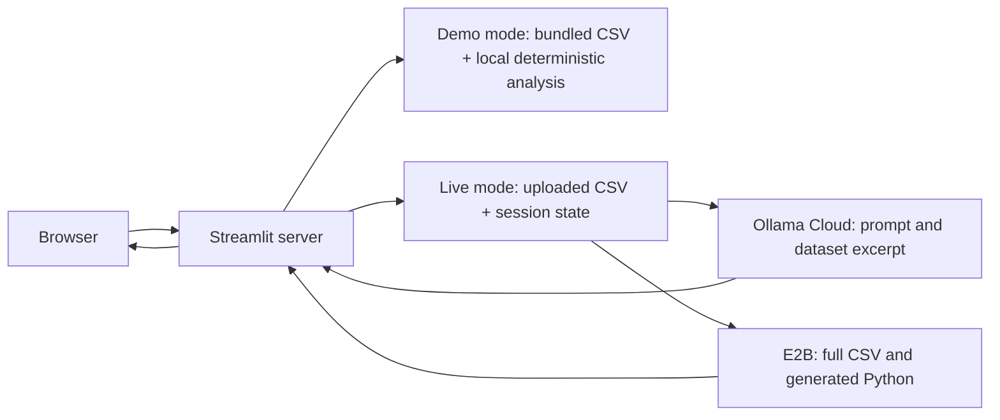

# AI Data Visualization Agent

AI Data Visualization Agent is a Streamlit application for profiling CSV datasets and exploring
them with natural-language prompts. It combines local dataset inspection, Ollama Cloud code
generation, E2B sandbox execution, and result review in one interface.

**[Try the public demo](https://vidhi-data-visualization-agent.streamlit.app)** - explore bundled
synthetic retail data with deterministic local analysis. No API keys are required, and the public
deployment does not call Ollama Cloud or E2B.

## Provenance

This repository began from Gurpreet Kaur's
[AI Data Visualization Agent](https://github.com/GURPREETKAURJETHRA/AI-Data-Visualization-Agent).
Vidhi Khandelwal substantially redesigned and extended that foundation into the current multi-page
workspace, including dataset profiling, constrained prompt-to-Python analysis, result
normalization, session isolation, deterministic demo mode, tests, and release checks. The full
contributor history is preserved in Git. Ollama Cloud, E2B, Streamlit, and the other named projects
are independent third-party services or libraries; this project does not claim their endorsement.

## Application flow

1. Open `Information` for the product overview.
2. In demo mode, explore the bundled synthetic CSV and deterministic local results.
3. In live mode, use `AI Workspace` to upload a CSV and run an analysis prompt.
4. Inspect the active file in `Dataset Lab`.
5. Review generated Python, charts, tables, explanations, and runtime logs.


```mermaid
flowchart LR
    U["Browser"] --> S["Streamlit server"]
    S --> D["Demo mode: bundled CSV + local deterministic analysis"]
    S --> L["Live mode: uploaded CSV + session state"]
    L --> O["Ollama Cloud: prompt and dataset excerpt"]
    O --> S
    L --> E["E2B: full CSV and generated Python"]
    E --> S
    S --> U
```

## Privacy and data flow

Public demo mode uses only bundled synthetic data. Live mode processes user uploads and should be
limited to an approved audience and approved data.

| Data | Destination | Current behavior |
| --- | --- | --- |
| Bundled demo CSV | Streamlit server | Loaded from source code and analyzed locally. Demo mode does not accept user uploads. |
| Uploaded live CSV | Streamlit server | Parsed in process and held in Streamlit session state. The app does not intentionally write the CSV to disk. |
| Dataset context | Ollama Cloud | In live mode, column names, types, summary counts, and the first five rows are included in the model prompt. Recent chat messages are also sent. |
| Full CSV | E2B | In live mode, uploaded to an E2B sandbox only when generated code is executed. |
| API keys | Streamlit server | Read from Streamlit secrets, environment variables, or password inputs. Sidebar values stay in session state; the app does not intentionally write keys to disk. |
| Prompts and results | Streamlit server | Held in session state for the active Streamlit session. The app does not provide durable history. |

Session memory can remain in the server process until eviction or restart, and the hosting
platform may add its own logs, backups, or telemetry. The app has no user authentication,
configurable retention policy, deletion audit, or data-classification controls. `Reset conversation`
clears sidebar keys and conversation history from the current session. Do not use live mode with
confidential, regulated, personal, or proprietary data unless the deployment and both external
providers have been approved for that data.

## Demo vs live mode

Set `DEMO_MODE=true` in the environment or Streamlit secrets to enable public demo mode.

- **Demo mode:** The upload control and provider key inputs are disabled. The app loads a bundled
  synthetic retail CSV and answers supported trend, comparison, satisfaction, and data-quality
  prompts with deterministic local Pandas routines. It does not call Ollama Cloud or E2B.
- **Live mode:** Leave `DEMO_MODE` unset or false. Users can upload CSV files and sending a prompt
  requires both API keys. Dataset excerpts and conversation context go to Ollama Cloud; the full CSV
  and generated Python go to E2B. Provider quotas, billing, availability, terms, and retention
  policies apply.

CI exercises the local demo boundary and does not call either external service.

## Models configured in the app

- `qwen3-coder:480b-cloud`
- `gpt-oss:120b-cloud`
- `gpt-oss:20b-cloud`
- `deepseek-v3.1:671b-cloud`

Model availability can change independently of this repository.

## Limitations

- CSV is the only supported upload format.
- Demo mode uses one synthetic dataset and a small set of deterministic analyses; it is not a general
  AI assistant and does not execute generated Python.
- Generated analysis is nondeterministic and may be incomplete, inaccurate, or produce failing
  Python in live mode. Review the code and results before using them for decisions.
- The model is instructed to use Pandas, NumPy, Matplotlib, and the Python standard library, but the
  application does not statically prove that generated code follows every instruction.
- E2B isolates generated code from the Streamlit host, but sandbox execution still processes the
  uploaded data with a third party.
- Live mode has no built-in application authentication, request-rate, user, or cost controls.
- Session state is not durable; reconnects, restarts, and platform behavior can discard work.
- Live analysis depends on external network access and valid provider accounts with available quota.

## Requirements

- Python 3.11 or 3.12
- An Ollama Cloud API key and E2B API key for live analysis

The repository defaults to Python 3.11 through `.python-version`. Direct dependencies are pinned in
`requirements.txt`; `requirements-lock.txt` constrains the full package snapshot captured from the
working Python 3.11.14 environment. CI installs that snapshot on both supported Python versions.

## Quickstart

```bash
git clone https://github.com/Vidhivk99/Data-Visualization-Agent.git
cd Data-Visualization-Agent
python3.11 -m venv .venv
. .venv/bin/activate
python -m pip install --disable-pip-version-check -r requirements.txt
```

For development and verification tools, install `requirements-dev.txt` instead; it includes the
runtime requirements:

```bash
python -m pip install --disable-pip-version-check -r requirements-dev.txt
```

Run the safe local demo without provider credentials:

```bash
DEMO_MODE=true streamlit run ai_data_visualisation_agent.py
```

For live analysis, create a local secrets file and add dedicated credentials:

```bash
cp .streamlit/secrets.toml.example .streamlit/secrets.toml
```

```toml
OLLAMA_API_KEY = "your_ollama_key"
E2B_API_KEY = "your_e2b_key"
```

Environment variables with the same names are also accepted. Run the app with:

```bash
streamlit run ai_data_visualisation_agent.py
```

## Verification

```bash
python -m pip check
python -m ruff check .
python -m pytest
python -c "import ai_data_visualisation_agent as app; assert callable(app.main)"
```

GitHub Actions runs those checks on Python 3.11 and 3.12. The tests cover importability, deterministic
filename and prompt helpers, and the bundled local demo result path. They do not validate provider
connectivity, model quality, sandbox behavior, browser interactions, or deployment readiness.

## Deployment

The verified public demo is available at
[vidhi-data-visualization-agent.streamlit.app](https://vidhi-data-visualization-agent.streamlit.app).
It deploys `main` on Streamlit Community Cloud with Python 3.11, `DEMO_MODE=true`, and no Ollama
Cloud or E2B credentials. A production-equivalent public demo deployment should:

1. Use Python 3.11 or 3.12 and install `requirements.txt`.
2. Set `DEMO_MODE=true` and do not configure Ollama Cloud or E2B credentials.
3. Start Streamlit with `--server.headless true --browser.gatherUsageStats false`.
4. Disable unnecessary network egress as defense in depth.
5. Use an ephemeral runtime, monitor availability, and run `docs/RELEASE_CHECKLIST.md` before release.

For a controlled live deployment, leave demo mode disabled, inject dedicated least-privilege
credentials through the platform's secret mechanism, restrict the audience, use only approved data,
set provider spending limits, and monitor usage. Do not expose live mode to untrusted traffic until
authentication, reviewed session isolation, retention controls, file and request limits, and
abuse/cost controls are in place.

## Repository layout

- `ai_data_visualisation_agent.py` - Streamlit application
- `.github/workflows/ci.yml` - Python 3.11/3.12 verification matrix
- `.streamlit/config.toml` - Streamlit settings
- `.streamlit/secrets.toml.example` - local secret names and placeholders
- `requirements.txt` - pinned direct runtime dependencies
- `requirements-dev.txt` - pinned test and lint tools
- `requirements-lock.txt` - exact working-environment constraints snapshot
- `tests/` - deterministic smoke tests
- `docs/RELEASE_CHECKLIST.md` - release and public-exposure gates
